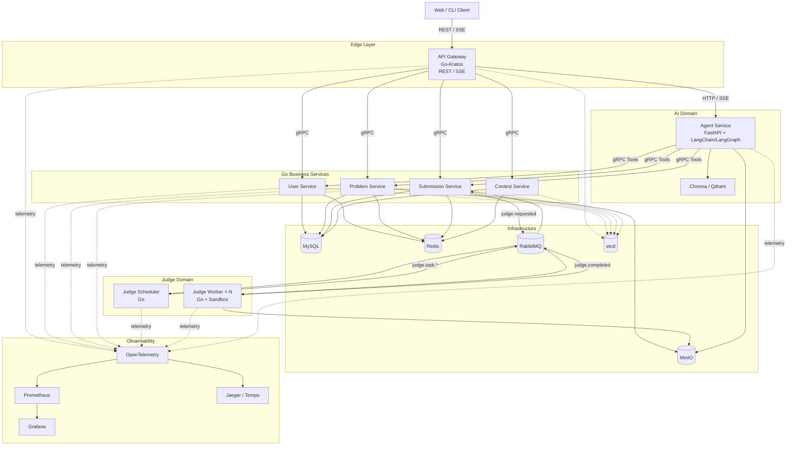
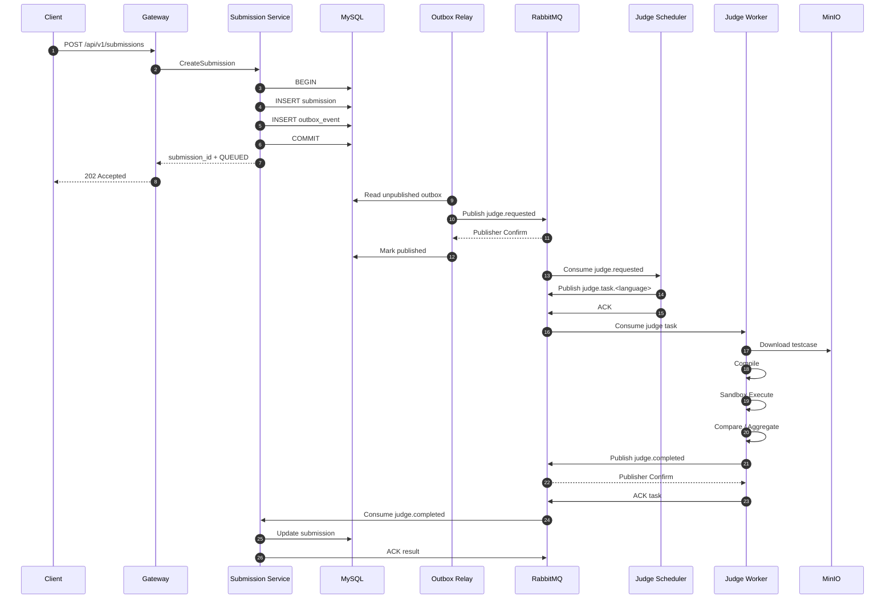
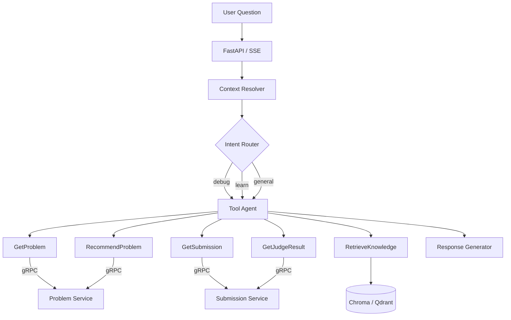
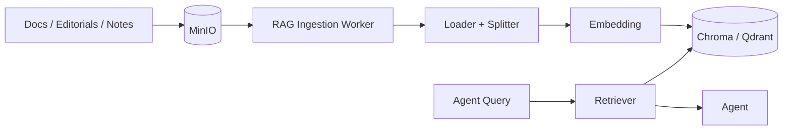
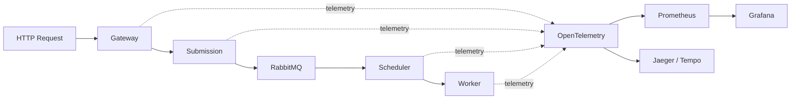
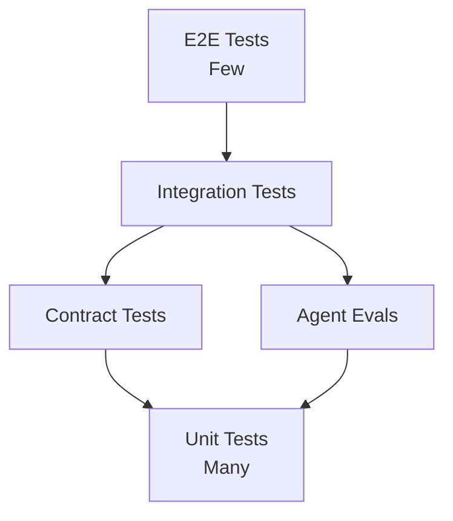

# 架构设计文档（Architecture Design）

## 1. 设计目标

本项目采用 **Git Monorepo + Independent Services**。

核心设计原则：

1. 按业务能力拆服务，不按数据库表拆服务。
2. 外部使用 REST / SSE，内部同步通信使用 gRPC + Protobuf。
3. 异步领域事件与 Judge Task 使用 RabbitMQ。
4. 每个服务拥有自己的数据，禁止跨服务直接访问数据库。
5. Submission 与 Judge 解耦，使用 Transactional Outbox 保证可靠投递。
6. Judge Worker 与业务服务使用不同扩容模型。
7. Agent 只能通过受控 Tool / gRPC 访问业务数据。
8. 安全、测试和可观测性属于架构的一部分，而不是后补功能。

---

## 2. 总体架构



---

## 3. 服务边界

| Service | Technology | Responsibility | Main Dependencies |
| --- | --- | --- | --- |
| `gateway-service` | Go + Kratos | REST、SSE、认证入口、限流、路由、Trace | Redis、etcd |
| `user-service` | Go + Kratos | 用户、认证、RBAC | MySQL、Redis |
| `problem-service` | Go + Kratos | 题目、标签、测试点 Metadata | MySQL、Redis、MinIO |
| `submission-service` | Go + Kratos | 提交、状态、结果、Outbox | MySQL、Redis、RabbitMQ |
| `contest-service` | Go + Kratos | 比赛、作业、排行榜 | MySQL、Redis |
| `judge-scheduler` | Go | Task 路由、优先级、Retry | RabbitMQ |
| `judge-worker` | Go | 编译、Sandbox 执行、结果聚合 | RabbitMQ、MinIO |
| `agent-service` | Python + FastAPI | Agent、RAG、Tool Calling、Streaming | gRPC、Vector DB、Redis |

### 3.1 数据所有权

禁止：

```text
contest-service
    ↓ SQL
submission tables
```

正确：

```text
contest-service
    ↓ gRPC
submission-service
```

或者：

```text
submission-service
    ↓ Domain Event
RabbitMQ
    ↓
contest-service
```

Agent 同样不允许直接访问 User / Problem / Submission / Contest 的业务表。

---

## 4. 仓库结构

```text
distributed-oj/
├── api/
│   ├── common/v1/
│   ├── user/v1/
│   ├── problem/v1/
│   ├── submission/v1/
│   ├── contest/v1/
│   └── judge/v1/
│
├── services/
│   ├── gateway/
│   ├── user/
│   ├── problem/
│   ├── submission/
│   ├── contest/
│   ├── judge-scheduler/
│   └── judge-worker/
│
├── pkg/
│   ├── auth/
│   ├── mq/
│   ├── cache/
│   ├── errors/
│   └── observability/
│
├── agent/
│   ├── app/
│   │   ├── api/
│   │   ├── graphs/
│   │   ├── tools/
│   │   ├── rag/
│   │   ├── clients/
│   │   └── core/
│   └── tests/
│
├── tests/
│   ├── integration/
│   ├── contract/
│   └── e2e/
│
├── migrations/
├── deploy/
├── scripts/
└── docs/
```

每个 Go-Kratos 服务内部保持：

```text
Transport
   ↓
Service
   ↓
Biz / Use Case
   ↓
Repository Interface
   ↑
Data Implementation
```

---

## 5. 通信模型

### 5.1 External

```text
Client
  ↓
REST / SSE
  ↓
Gateway
```

REST：

- 普通 CRUD / Query。
- 登录、题目、提交等同步请求。

SSE：

- Judge 状态。
- Agent Streaming。
- 长任务进度。

### 5.2 Internal Synchronous

```text
Service
  ↓
gRPC + Protobuf
  ↓
Service
```

适用于：

- GetUser
- GetProblem
- GetSubmission
- Authorization Context
- Agent Tool Calling

### 5.3 Internal Asynchronous

```text
Producer
  ↓
RabbitMQ
  ↓
Consumer
```

适用于：

- Judge Task
- Judge Result
- Submission Event
- Contest Event

---

## 6. Submission / Judge 架构



### 6.1 Transactional Outbox

禁止：

```text
INSERT submission
COMMIT
RabbitMQ.Publish()
```

因为可能产生：

```text
DB Success
MQ Failure
```

正确：

```text
BEGIN
  INSERT submission
  INSERT outbox_event
COMMIT
```

之后由 Outbox Relay 发布消息并等待 Publisher Confirm。

### 6.2 Delivery Model

默认：

```text
At-least-once Delivery
```

因此需要：

- `event_id`
- Publisher Confirm
- Manual ACK
- Idempotent Consumer
- bounded Retry
- DLQ
- bounded Prefetch
- Backoff

---

## 7. RabbitMQ Topology

建议 Topic Exchange：

```text
oj.events
```

Routing Keys：

```text
submission.created
submission.judged

judge.requested
judge.started
judge.completed
judge.failed

contest.started
contest.ended
```

Judge Task Queues：

```text
judge.task.cpp
judge.task.go
judge.task.python
judge.task.java
```

失败消息：

```text
judge.retry
judge.dlq
```

Event Envelope：

```json
{
  "event_id": "uuid",
  "event_type": "judge.requested",
  "event_version": 1,
  "occurred_at": "RFC3339 timestamp",
  "trace_id": "trace id",
  "data": {}
}
```

---

## 8. Judge Worker

目录建议：

```text
judge-worker/
├── consumer/
├── compiler/
├── runner/
├── sandbox/
├── comparator/
├── testcase/
└── reporter/
```

抽象：

```go
type LanguageRunner interface {
    Compile(ctx context.Context, source string) (*Artifact, error)
    Run(ctx context.Context, artifact *Artifact, input []byte) (*RunResult, error)
}

type Sandbox interface {
    Execute(ctx context.Context, req RunRequest) (RunResult, error)
}
```

重点使用：

- goroutine
- channel
- bounded worker pool
- `context.Context`
- timeout / cancellation
- `errgroup`
- resource cleanup

不要启动无上限 goroutine。

---

## 9. Sandbox

用户代码视为不可信代码。

最低安全约束：

```text
Linux Namespace
cgroups v2
seccomp
rlimit
non-root user
network disabled
read-only filesystem
process limit
CPU limit
memory limit
file size limit
execution timeout
syscall restriction
```

环境建议：

```text
Local Development: Docker Sandbox
Production-like: nsjail / gVisor
```

禁止将未经处理的用户输入直接拼接为 Shell Command。

---

## 10. Agent 架构



设计原则：

- 第一阶段保持单 Agent + LangGraph Workflow。
- 不为了展示技术强行拆多 Agent。
- LLM 不负责最终 Authorization。
- Tool 使用 typed input / output。
- Tool 只拿完成任务所需的最少数据。

---

## 11. RAG



Metadata 建议：

```text
document_id
source
version
problem_id
algorithm
difficulty
language
document_type
```

Development 使用 Chroma；Production-like 可替换 Qdrant。

---

## 12. Redis / MinIO

### Redis

职责：

- Problem Cache
- Submission Realtime Status
- Refresh Token Metadata
- Rate Limit
- Idempotency
- Contest Leaderboard
- SSE Fan-out
- Temporary State

原则：

```text
Redis = Cache / Realtime View
MySQL = Source of Truth
```

### MinIO

Bucket / Prefix：

```text
problem-data/
submission-artifacts/
rag-documents/
```

MySQL 仅保存对象元数据，例如：

```text
object_key
sha256
size
version
```

---

## 13. 服务发现与部署

Local：

```text
Docker Compose
+
etcd
```

Production-like：

```text
Kubernetes
```

本地开发可以使用 etcd 进行 Kratos 服务发现；进入 Kubernetes 后优先使用 Kubernetes Service Discovery，不强行叠加第二套发现机制。

---

## 14. 可观测性



RabbitMQ Header 中传播 Trace Context。

关键 Metrics：

- HTTP/gRPC latency / error rate。
- MQ publish failure / retry / DLQ size。
- Judge queue time / compile time / execute time / verdict count。
- Agent latency / tool failure / retrieval latency / eval pass rate。

---

## 15. 测试架构



重点：

- Unit：业务规则、Judge 聚合、权限、Agent 路由。
- Integration：MySQL、Redis、RabbitMQ、MinIO、gRPC。
- Contract：Proto / Event Schema。
- Fuzz：Comparator、Parser、Decoder。
- E2E：提交判题主链路、Agent Tool 权限主链路。

---

## 16. CI / Git

Git Workflow：

```text
Issue
  ↓
Short-lived Branch
  ↓
Code + Tests
  ↓
Pull Request
  ↓
CI
  ↓
Review
  ↓
Squash Merge
  ↓
main
```

PR 至少执行：

```text
Go fmt / vet / lint / test / build
Python lint / type check / pytest
buf lint / buf breaking
Integration Test
Docker Build
Security Scan
```

---

## 17. 关键架构不变量

1. Service 不直接访问其他 Service 的数据库。
2. Agent 不直接访问业务数据库。
3. DB Change + MQ Event 可靠写入使用 Outbox。
4. RabbitMQ Consumer 必须幂等。
5. Judge 用户代码始终视为不可信。
6. LLM / Prompt 不是授权边界。
7. 核心 IO 必须传播 Context / Timeout。
8. Generated Code 不手工修改。
9. 架构级变更应通过 ADR 记录。
