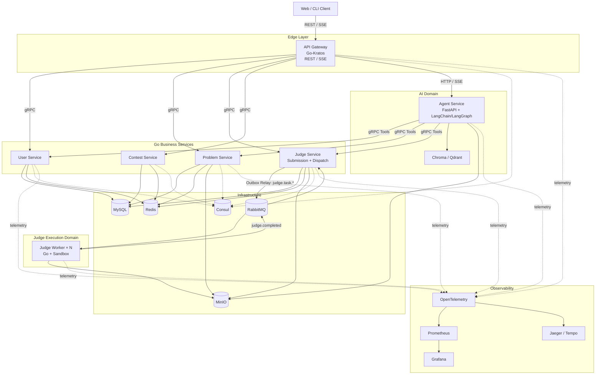
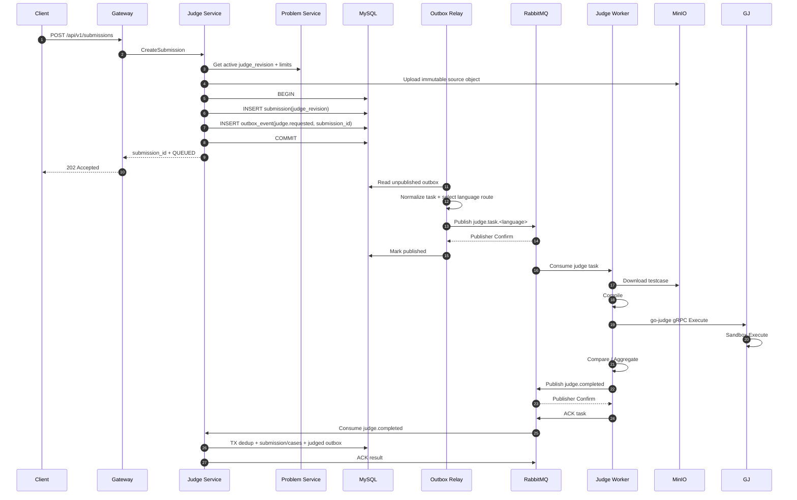
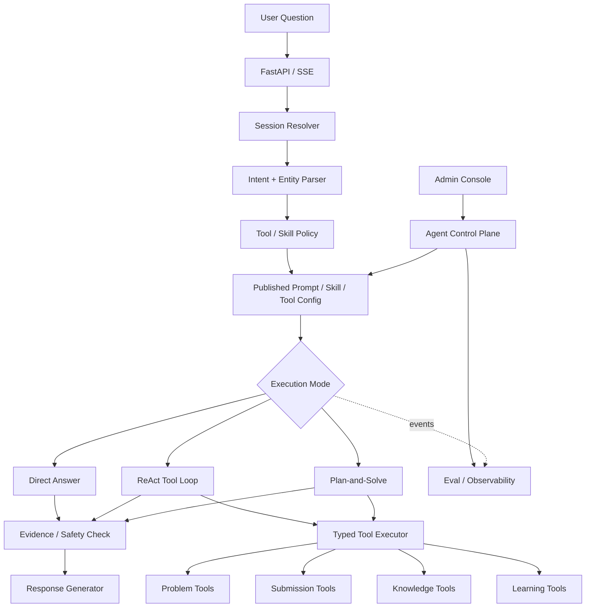
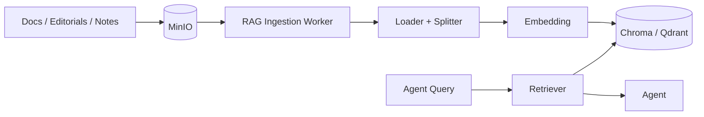
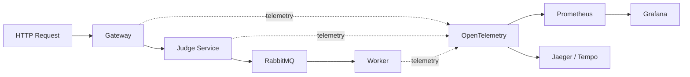
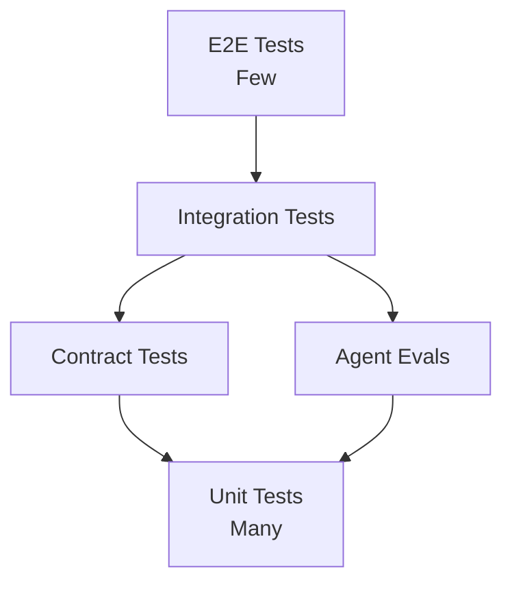

# 架构设计文档（Architecture Design）

## 1. 设计目标

本项目采用 **Git Monorepo + Independent Services**。

核心设计原则：

1. 按业务能力拆服务，不按数据库表拆服务。
2. 外部使用 REST / SSE，内部同步通信使用 gRPC + Protobuf。
3. 异步领域事件与 Judge Task 使用 RabbitMQ。
4. 每个服务拥有自己的数据，禁止跨服务直接访问数据库。
5. `judge-service` 统一拥有 Submission、调度策略和结果状态，使用 Transactional Outbox 保证 Judge Task 可靠投递。
6. Judge Worker 与业务服务使用不同扩容模型。
7. Agent 只能通过受控 Tool / gRPC 访问业务数据。
8. 安全、测试和可观测性属于架构的一部分，而不是后补功能。

---

## 2. 总体架构


```mermaid
flowchart TB
    Client["Web / CLI Client"]

    subgraph Edge["Edge Layer"]
        Gateway["API Gateway<br/>Go-Kratos<br/>REST / SSE"]
    end

    subgraph Domain["Go Business Services"]
        User["User Service"]
        Problem["Problem Service"]
        Judge["Judge Service<br/>Submission + Dispatch"]
        Contest["Contest Service"]
    end

    subgraph JudgeDomain["Judge Execution Domain"]
        Worker["Judge Worker × N<br/>Go + Sandbox"]
    end

    subgraph AI["AI Domain"]
        Agent["Agent Service<br/>FastAPI + LangChain/LangGraph"]
        Vector["Chroma / Qdrant"]
    end

    subgraph Infra["Infrastructure"]
        MySQL[("MySQL")]
        Redis[("Redis")]
        RabbitMQ[("RabbitMQ")]
        MinIO[("MinIO")]
        Consul[("Consul")]
    end

    subgraph Obs["Observability"]
        OTel["OpenTelemetry"]
        Prometheus["Prometheus"]
        Grafana["Grafana"]
        Trace["Jaeger / Tempo"]
    end

    Client -->|"REST / SSE"| Gateway

    Gateway -->|"gRPC"| User
    Gateway -->|"gRPC"| Problem
    Gateway -->|"gRPC"| Judge
    Gateway -->|"gRPC"| Contest
    Gateway -->|"HTTP / SSE"| Agent

    Judge -->|"Outbox Relay: judge.task.*"| RabbitMQ
    RabbitMQ --> Worker
    Worker -->|"judge.completed"| RabbitMQ
    RabbitMQ --> Judge

    Agent -->|"gRPC Tools"| User
    Agent -->|"gRPC Tools"| Problem
    Agent -->|"gRPC Tools"| Judge
    Agent --> Vector

    User --> MySQL
    Problem --> MySQL
    Judge --> MySQL
    Contest --> MySQL

    User --> Redis
    Problem --> Redis
    Judge --> Redis
    Contest --> Redis

    Problem --> MinIO
    Judge --> MinIO
    Worker --> MinIO
    Agent --> MinIO

    Gateway -.-> Consul
    User -.-> Consul
    Problem -.-> Consul
    Judge -.-> Consul
    Contest -.-> Consul

    Gateway -. telemetry .-> OTel
    User -. telemetry .-> OTel
    Problem -. telemetry .-> OTel
    Judge -. telemetry .-> OTel
    Worker -. telemetry .-> OTel
    Agent -. telemetry .-> OTel

    OTel --> Prometheus
    OTel --> Trace
    Prometheus --> Grafana
```

---

## 3. 服务边界

| Service | Technology | Responsibility | Main Dependencies |
| --- | --- | --- | --- |
| `gateway-service` | Go + Kratos | REST、SSE、认证入口、限流、路由、Trace | Redis、Consul |
| `user-service` | Go + Kratos | 用户、认证、RBAC | MySQL、Redis、Consul |
| `problem-service` | Go + Kratos | 题目、标签、测试点 Metadata | MySQL、Redis、MinIO、Consul |
| `judge-service` | Go + Kratos | 提交、源码对象、状态、结果、调度策略、Outbox Relay、结果消费 | MySQL、Redis、RabbitMQ、MinIO、Consul |
| `contest-service` | Go + Kratos | 比赛、作业、排行榜 | MySQL、Redis、Consul |
| `judge-worker` | Go | 编译、Sandbox 执行、结果聚合 | RabbitMQ、MinIO |
| `agent-service` | Python + FastAPI | Agent、RAG、Tool Calling、Streaming | gRPC、Vector DB、Redis |

### 3.1 数据所有权

禁止：

```text
contest-service
    ↓ SQL
submission tables
```

正确：

```text
contest-service
    ↓ gRPC
judge-service
```

或者：

```text
judge-service
    ↓ Domain Event
RabbitMQ
    ↓
contest-service
```

Agent 同样不允许直接访问 User / Problem / Submission / Contest 的业务表。

---

## 4. 仓库结构

```text
distributed-oj/
├── api/
│   ├── common/v1/
│   ├── user/v1/
│   ├── problem/v1/
│   ├── submission/v1/
│   ├── contest/v1/
│   └── judge/v1/
│
├── services/
│   ├── gateway/
│   ├── user/
│   ├── problem/
│   ├── judge/
│   ├── contest/
│   └── judge-worker/
│
├── pkg/
│   ├── auth/
│   ├── mq/
│   ├── cache/
│   ├── errors/
│   └── observability/
│
├── agent/
│   ├── app/
│   │   ├── api/
│   │   ├── graphs/
│   │   ├── tools/
│   │   ├── rag/
│   │   ├── clients/
│   │   └── core/
│   └── tests/
│
├── tests/
│   ├── integration/
│   ├── contract/
│   └── e2e/
│
├── migrations/
├── deploy/
├── scripts/
└── docs/
```

每个 Go-Kratos 服务内部保持：

```text
Transport
   ↓
Service
   ↓
Biz / Use Case
   ↓
Repository Interface
   ↑
Data Implementation
```

---

## 5. 通信模型

### 5.1 External

```text
Client
  ↓
REST / SSE
  ↓
Gateway
```

REST：

- 普通 CRUD / Query。
- 登录、题目、提交等同步请求。

SSE：

- Judge 状态。
- Agent Streaming。
- 长任务进度。

### 5.2 Internal Synchronous

```text
Service
  ↓
gRPC + Protobuf
  ↓
Service
```

适用于：

- GetUser
- GetProblem
- GetSubmission
- Authorization Context
- Agent Tool Calling

### 5.3 Internal Asynchronous

```text
Producer
  ↓
RabbitMQ
  ↓
Consumer
```

适用于：

- Judge Task
- Judge Result
- Submission Event
- Contest Event

---

## 6. Submission / Judge 架构


```mermaid
sequenceDiagram
    autonumber

    participant C as Client
    participant G as Gateway
    participant J as Judge Service
    participant P as Problem Service
    participant DB as MySQL
    participant O as Outbox Relay
    participant MQ as RabbitMQ
    participant JW as Judge Worker
    participant M as MinIO

    C->>G: POST /api/v1/submissions
    G->>J: CreateSubmission
    J->>P: Get active judge_revision + limits
    J->>M: Upload immutable source object

    J->>DB: BEGIN
    J->>DB: INSERT submission(judge_revision)
    J->>DB: INSERT outbox_event(judge.requested, submission_id)
    J->>DB: COMMIT

    J-->>G: submission_id + QUEUED
    G-->>C: 202 Accepted

    O->>DB: Read unpublished outbox
    O->>O: Normalize task + select language route
    O->>MQ: Publish judge.task.<language>
    MQ-->>O: Publisher Confirm
    O->>DB: Mark published

    MQ->>JW: Consume judge task
    JW->>M: Download testcase
    JW->>JW: Compile
    JW->>GJ: go-judge gRPC Execute
    GJ->>GJ: Sandbox Execute
    JW->>JW: Compare / Aggregate

    JW->>MQ: Publish judge.completed
    MQ-->>JW: Publisher Confirm
    JW->>MQ: ACK task

    MQ->>J: Consume judge.completed
    J->>DB: TX dedup + submission/cases + judged outbox
    J->>MQ: ACK result
```

### 6.1 Transactional Outbox

禁止：

```text
INSERT submission
COMMIT
RabbitMQ.Publish()
```

因为可能产生：

```text
DB Success
MQ Failure
```

正确：

```text
BEGIN
  INSERT submission
  INSERT outbox_event
COMMIT
```

之后由 `judge-service` 内部的 Outbox Relay 读取事件，完成任务规范化和语言路由，直接发布到 `judge.task.<language>` 并等待 Publisher Confirm。首版只启动一个 `judge-service` 实例，API、Relay 和 Result Consumer 在同一进程中作为独立模块运行；后续可以拆成运行角色，但不会形成新的业务服务。

### 6.2 Delivery Model

默认：

```text
At-least-once Delivery
```

因此需要：

- `event_id`
- Publisher Confirm
- Manual ACK
- Idempotent Consumer
- bounded Retry
- DLQ
- bounded Prefetch
- Backoff

结果消息必须携带 `submission_id` 与 `judge_revision`。Judge Service 在同一
事务完成消费去重、Submission/Case Result 及 `submission.judged` Outbox；
已取消、已作废或已超时 Submission 的迟到结果不得覆盖终态。MySQL 是 SSE
可恢复的事实来源，Redis 只保存实时视图。

---

## 7. RabbitMQ Topology

建议 Topic Exchange：

```text
oj.events
```

Routing Keys：

```text
submission.created
submission.judged
submission.invalidated

judge.started
judge.completed
judge.failed

contest.started
contest.ended
```

Judge Task Queues：

```text
judge.task.cpp
judge.task.c
judge.task.go
judge.task.python
judge.task.java
```

失败消息：

```text
judge.retry.cpp
judge.retry.go
judge.retry.python
judge.retry.java
judge.dlq
```

Worker 捕获到可重试系统故障时，把原任务送入对应语言的 Retry Queue；队列
TTL 到期后通过 DLX 回到 `judge.task.<language>`。Consumer 根据 RabbitMQ
`x-death` 计数，最多重试 3 次后转入 `judge.dlq`。Worker 进程直接崩溃可能
只触发未 ACK 消息 redelivery，因此 Submission 还必须有总 deadline，由
Judge Service Reconciler 将长期无结果任务收敛为 `DONE/SYSTEM_ERROR`。

RabbitMQ 短暂不可用不立即产生 SYSTEM_ERROR。Outbox 保留未发布意图；Worker
必须在结果发布收到 Publisher Confirm 后才 ACK 原任务。只有 DLQ 耗尽或超过
总 deadline，Judge Service 才写入 SYSTEM_ERROR。

Event Envelope：

```json
{
  "event_id": "uuid",
  "event_type": "judge.completed",
  "event_version": 1,
  "occurred_at": "RFC3339 timestamp",
  "trace_id": "trace id",
  "data": {}
}
```

Judge Task 的公共 `event_type` 为 `judge.task`，语言由 routing key 区分；
`judge.requested` 只作为 Judge Service 内部 Outbox Intent。Envelope、Task、
Completed 和 Failed 的代码契约统一放在 `pkg/mq`。

Problem 的每个 immutable revision 在 manifest 顶层保存一份题目级时间和内存
限制，该 revision 下所有测试点共享。修改限制与修改测试点一样会生成新
revision，MySQL 仍只保存最新 active 指针。

---

## 8. Judge Worker

首版 Worker 通过 gRPC 调用独立的 `go-judge v1.12.3` Sandbox Service。Worker 不直接
执行用户代码，go-judge 不持有 RabbitMQ、MinIO、MySQL 或业务 JWT 凭据；Worker 使用
固定的 Go 编译参数和 manifest 中的题目级资源限制。Worker 已接入 MinIO immutable
input loader：源码来自 `submission-source`，manifest 和测试点来自 `problem-data`，
下载后验证 revision、对象 key、size 与 SHA-256。正式消息消费仍按后续 Worker Issue
接入。

目录建议：

```text
judge-worker/
├── consumer/
├── compiler/
├── runner/
├── sandbox/
├── comparator/
├── testcase/
└── reporter/
```

抽象：

```go
type LanguageRunner interface {
    Compile(ctx context.Context, source string) (*Artifact, error)
    Run(ctx context.Context, artifact *Artifact, input []byte) (*RunResult, error)
}

type Sandbox interface {
    Execute(ctx context.Context, req RunRequest) (RunResult, error)
}
```

重点使用：

- goroutine
- channel
- bounded worker pool
- `context.Context`
- timeout / cancellation
- `errgroup`
- resource cleanup

不要启动无上限 goroutine。

---

## 9. Sandbox

用户代码视为不可信代码。

最低安全约束：

```text
Linux Namespace
cgroups v2
seccomp
rlimit
non-root user
network disabled
read-only filesystem
process limit
CPU limit
memory limit
file size limit
execution timeout
syscall restriction
```

环境建议：

```text
Local Development: Docker Sandbox
Production-like: nsjail / gVisor
```

禁止将未经处理的用户输入直接拼接为 Shell Command。

---

## 10. Agent 架构

Agent Service 是面向编程学习的通用 Agent，不绑定单一的提交诊断流程。算法解释、题目理解、分级 Hint、提交诊断、历史复盘、题目推荐和学习计划都运行在同一个 Agent Runtime 上，由 Skill 声明目标、可用 Tool、Prompt、输出结构和预算。


```mermaid
flowchart TB
    Question["User Question"] --> API["FastAPI / SSE"]
    API --> Session["Session Resolver"]
    Session --> Intent["Intent + Entity Parser"]
    Intent --> Policy["Tool / Skill Policy"]
    Policy --> Config["Published Prompt / Skill / Tool Config"]
    Config --> Runtime{"Execution Mode"}

    Runtime --> Direct["Direct Answer"]
    Runtime --> React["ReAct Tool Loop"]
    Runtime --> Plan["Plan-and-Solve"]
    React --> Executor["Typed Tool Executor"]
    Plan --> Executor
    Executor --> Problem["Problem Tools"]
    Executor --> Submission["Submission Tools"]
    Executor --> Knowledge["Knowledge Tools"]
    Executor --> Profile["Learning Tools"]

    Direct --> Verify["Evidence / Safety Check"]
    React --> Verify
    Plan --> Verify
    Verify --> Response["Response Generator"]

    Admin["Admin Console"] --> Control["Agent Control Plane"]
    Control --> Config
    Control --> Eval["Eval / Observability"]
    Runtime -. events .-> Eval
```

设计原则：

- Context Resolver 只解析 submission_id、problem_id、语言和时间范围等实体，不自动预取业务数据。
- Agent 从当前策略允许的 Tool 集合中选择工具；工具选择和参数必须经过程序校验。
- 第一阶段保持单 Agent + LangGraph Workflow，不为了展示技术强行拆多 Agent。
- ReAct 用于有限的动态取证；Plan-and-Solve 用于学习计划、历史复盘等多步骤任务。
- Reflection 只检查证据、引用、安全和不确定性，不负责授予权限。
- LLM、Prompt、Skill 和知识库内容都不是授权边界。
- Tool 使用 typed input / output，Tool Executor 统一处理超时、去重、脱敏和预算。
- Tool 的实现、RPC 方法、权限校验和安全前缀由代码保护；Prompt、Skill 绑定、预算和知识库内容由 Control Plane 管理。

### 10.1 Agent Runtime

PR2 当前提供 `RunService`、typed State/Event、Fake Runtime、可注入 ModelClient 的最小
LangGraph `thinking → response` 图和 `oj_agent` 持久化。它尚未提供 HTTP Chat/SSE；
可信 Principal 由将来的 Gateway 委托认证入口创建。当前可运行入口是显式启用的本地
demo，生产配置禁止 fake，默认 Runtime disabled。管理员控制面和真实模型后续接入。

用户消息和 RUNNING 在事务中接受，完成答案和终态在事务中保存，成功持久化后才
发 `done`；失败/取消不保存部分 assistant 输出。单实例启动收敛旧 RUNNING 为
INTERRUPTED，同会话并发由数据库生成列唯一索引约束，不依赖内存锁。调用方消费流
必须使用 `AcceptedRun` 上下文或显式关闭，才能在流开始前/后取消并清理 Run。

运行时状态至少包括：

```text
user_id / conversation_id / run_id / trace_id
intent / goal / entities / constraints
skill_key / allowed_tools / config_snapshot
plan / observations / evidence / missing_information
tool_call_count / remaining_tokens / deadline / reflection_count
answer_draft / final_answer
```

执行模式包括：

```text
direct
react
plan_execute
reflection
```

每次 Agent Run 开始时固定 Prompt、Skill、Tool Catalog、模型和知识库索引的版本快照。一次回答执行期间不得切换已发布配置；草稿不会影响在线请求。

### 10.2 Tool Registry 与策略

代码 Registry 只注册 Tool 实现和不可绕过的安全元数据。第一批只读 Tool 包括：

```text
get_current_user
get_problem
list_problems
get_submission
get_submission_source
get_judge_result
list_submissions
retrieve_knowledge
```

后续增加：

```text
get_learning_profile
search_problems
recommend_problem
create_submission
rejudge_submission
```

每个 Tool 声明 `read_scope`、`allowed_roles`、`side_effect`、`sensitivity`、超时、成本和是否需要确认。管理员可以在 Skill 层调整 Tool allowlist 和启用状态，但不能修改 RPC 方法、目标服务或授权实现。写 Tool 默认关闭。

### 10.3 Agent Control Plane

Control Plane 管理以下可版本化资源：

```text
Prompt / Prompt Version
Skill / Skill Version / Skill-Tool Binding
Tool Catalog Policy
Knowledge Document / Knowledge Version / Index
Eval Case / Eval Dataset / Eval Run
```

资源状态统一使用：

```text
DRAFT → PUBLISHED → ARCHIVED
```

发布版本不可变；回滚通过重新发布旧版本完成。Prompt 发布前校验变量白名单、敏感信息、Tool 名称和禁止指令。Skill 只能引用代码已注册的 Tool，不能执行任意 Python。

### 10.4 管理员前端

管理员入口使用 `system_admin` 或明确授权的 `agent_admin` 角色，至少提供：

- Prompt 管理：编辑、版本 Diff、样例 Eval、发布、回滚和审计。
- Tool Catalog：查看描述、Schema、来源 RPC、敏感级别、允许角色、启用状态和调用统计；RPC 方法和授权代码只读展示。
- Skill 管理：编辑元数据、选择 Tool、绑定 Prompt、设置预算、样例运行、发布和回滚。
- 知识库管理：文档上传、元数据、标签、切分预览、索引、发布、归档和回滚。
- Eval 与质量：运行数据集、版本对比、失败样例、工具选择错误、引用错误和拒答错误。
- 运行观测：请求量、延迟、Token、Tool 错误、RAG 延迟、Skill 分布、Trace 和脱敏后的运行详情。

发布、回滚、归档和启用写 Tool 需要二次确认并写入审计日志；生产环境可以配置双人审批。管理员页面不能修改安全前缀、服务身份或目标 Go Service 的授权规则。

### 10.5 Agent 质量工程

离线 Eval、线上运行事件和人工抽检使用同一套配置版本标识。评估包括：

- 确定性行为：意图、Skill、Tool、参数、权限、状态转换、预算和输出 Schema；
- 模型质量：事实正确性、相关性、解释完整性、Hint 等级、引用一致性和不确定性标注；
- 人工抽检：按 Skill、模型和配置版本抽样，失败样例回流数据集。

核心指标包括：

```text
tool_selection_pass_rate
tool_argument_pass_rate
permission_denied_correct_rate
evidence_grounded_rate
citation_valid_rate
answer_relevance_score
answer_correctness_score
hint_level_accuracy
clarification_rate
unsafe_action_block_rate
fallback_rate
```

运行事件至少记录 `run_id`、`conversation_id`、`user_id`、`trace_id`、Skill/Prompt/Tool Catalog 版本、模型、Tool 延迟和状态、Token 使用、答案状态和 Eval 标签。源码、凭据、完整 Prompt 和原始 Tool Result 默认脱敏或只保存摘要。

## 11. RAG


```mermaid
flowchart LR
    Docs["Docs / Editorials / Notes"] --> Storage[("MinIO")]
    Storage --> Worker["RAG Ingestion Worker"]
    Worker --> Split["Loader + Splitter"]
    Split --> Embed["Embedding"]
    Embed --> Vector[("Chroma / Qdrant")]

    Query["Agent Query"] --> Retriever["Retriever"]
    Retriever --> Vector
    Retriever --> Agent["Agent"]
```

Metadata 建议：

```text
document_id
source
version
problem_id
algorithm
difficulty
language
document_type
```

Development 使用 Chroma；Production-like 可替换 Qdrant。

---

## 12. Redis / MinIO

### Redis

职责：

- Problem Cache
- Submission Realtime Status
- Refresh Token Metadata
- Rate Limit
- Idempotency
- Contest Leaderboard
- SSE Fan-out
- Temporary State

原则：

```text
Redis = Cache / Realtime View
MySQL = Source of Truth
```

### MinIO

Bucket / Prefix：

```text
problem-data/
submission-artifacts/
rag-documents/
```

MySQL 仅保存对象元数据，例如：

```text
object_key
sha256
size
version
```

---

## 13. 服务发现与部署

Local：

```text
Docker Compose
+
Consul
```

Production-like：

```text
Kubernetes
```

本地开发和非 Kubernetes 部署使用 Consul 提供服务注册与发现；进入 Kubernetes 后优先使用 Kubernetes Service Discovery，不强行叠加第二套发现机制。当前 `user-service` 已使用 Kratos Consul Registrar 完成服务注册和注销，并开启 Consul 健康检查；其他服务在各自接入阶段复用相同模式。

当前 Gateway 骨架位于 `services/gateway`，使用 `cmd/server` 作为入口，先提供 HTTP Server、配置、middleware、client 与 service 扩展点。Gateway 后续通过 gRPC 调用 `user-service`，不会直接访问用户数据库。

---

## 14. 可观测性


```mermaid
flowchart LR
    HTTP["HTTP Request"] --> Gateway["Gateway"]
    Gateway --> Judge["Judge Service"]
    Judge --> MQ["RabbitMQ"]
    MQ --> Worker["Worker"]

    Gateway -. telemetry .-> OTel["OpenTelemetry"]
    Judge -. telemetry .-> OTel
    Worker -. telemetry .-> OTel

    OTel --> Metrics["Prometheus"]
    OTel --> Traces["Jaeger / Tempo"]
    Metrics --> Grafana["Grafana"]
```

RabbitMQ Header 中传播 Trace Context。

关键 Metrics：

- HTTP/gRPC latency / error rate。
- MQ publish failure / retry / DLQ size。
- Judge queue time / compile time / execute time / verdict count。
- Agent latency / tool failure / retrieval latency / eval pass rate。

---

## 15. 测试架构


```mermaid
flowchart TB
    E2E["E2E Tests<br/>Few"]
    Integration["Integration Tests"]
    Contract["Contract Tests"]
    AgentEval["Agent Evals"]
    Unit["Unit Tests<br/>Many"]

    E2E --> Integration
    Integration --> Contract
    Integration --> AgentEval
    Contract --> Unit
    AgentEval --> Unit
```

重点：

- Unit：业务规则、Judge 聚合、权限、Agent 路由。
- Integration：MySQL、Redis、RabbitMQ、MinIO、gRPC。
- Contract：Proto / Event Schema。
- Fuzz：Comparator、Parser、Decoder。
- E2E：提交判题主链路、Agent Tool 权限主链路。

---

## 16. CI / Git

Git Workflow：

```text
Issue
  ↓
Short-lived Branch
  ↓
Code + Tests
  ↓
Pull Request
  ↓
CI
  ↓
Review
  ↓
Squash Merge
  ↓
main
```

PR 至少执行：

```text
Go fmt / vet / lint / test / build
Python lint / type check / pytest
buf lint / buf breaking
Integration Test
Docker Build
Security Scan
```

---

## 17. 关键架构不变量

1. Service 不直接访问其他 Service 的数据库。
2. Agent 不直接访问业务数据库。
3. DB Change + MQ Event 可靠写入使用 Outbox。
4. RabbitMQ Consumer 必须幂等。
5. Judge 用户代码始终视为不可信。
6. LLM / Prompt 不是授权边界。
7. 核心 IO 必须传播 Context / Timeout。
8. Generated Code 不手工修改。
9. 架构级变更应通过 ADR 记录。
