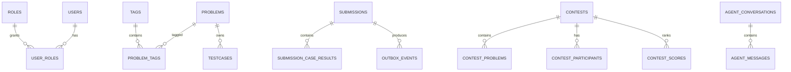

# 数据库设计文档（Database Design）

## 1. 设计原则

本项目使用 MySQL 作为核心业务数据的 Source of Truth。

核心原则：

1. **Data Ownership**：每个 Service 只能直接访问自己拥有的 Schema / Table。
2. **Logical Database per Service**：本地可以只运行一个 MySQL 实例，但逻辑上按服务隔离。
3. Redis 是 Cache / Realtime View，不替代核心持久化事实。
4. 测试数据、源码产物、编译日志和 RAG 原始文档优先存 MinIO。
5. 所有 Schema Change 通过 Migration 管理。
6. DB State Change + MQ Event 需要可靠一致性时使用 Transactional Outbox。
7. 跨服务关联通过 ID、gRPC 或 Event，不使用跨服务 SQL Join。

v0 建议逻辑 Schema：

```text
oj_user
oj_problem
oj_submission
oj_contest
oj_agent
```

这些 Schema 可以部署在同一个 MySQL Container 中，但所有权保持独立。

---

## 2. 数据所有权

| Schema | Owner | Core Data |
| --- | --- | --- |
| `oj_user` | user-service | User、Role |
| `oj_problem` | problem-service | Problem、Tag、Testcase Metadata |
| `oj_submission` | judge-service | Submission、Case Result、Outbox、Dedup |
| `oj_contest` | contest-service | Contest、Participant、Leaderboard Snapshot |
| `oj_agent` | agent-service | Conversation、Message |

禁止：

```text
contest-service
  ↓ SQL JOIN
oj_submission.submissions
```

正确：

```text
contest-service
  ↓ gRPC / RabbitMQ Event
judge-service
```

Agent 也不允许读取其他业务 Schema。

---

## 3. ER 总览



注意：图中关系描述逻辑关系；不同 Service Schema 之间不建立跨库外键。

---

# 4. `oj_user`

## 4.1 `users`

职责：用户账户与认证主体。

| Column | Type | Constraint / Note |
| --- | --- | --- |
| `id` | BIGINT | PK |
| `username` | VARCHAR(64) | UNIQUE, NOT NULL |
| `email` | VARCHAR(255) | UNIQUE, NOT NULL |
| `password_hash` | VARCHAR(255) | NOT NULL |
| `status` | VARCHAR(32) | NOT NULL |
| `created_at` | DATETIME(3) | NOT NULL |
| `updated_at` | DATETIME(3) | NOT NULL |

建议索引：

```text
UNIQUE(username)
UNIQUE(email)
INDEX(status, created_at)
```

密码只保存安全 Hash，不保存明文密码。

## 4.2 `roles`

| Column | Type | Note |
| --- | --- | --- |
| `id` | BIGINT | PK |
| `name` | VARCHAR(64) | UNIQUE |
| `description` | VARCHAR(255) | Optional |

初始角色可以包括：

```text
user
problem_admin
system_admin
```

## 4.3 `user_roles`

| Column | Type | Note |
| --- | --- | --- |
| `user_id` | BIGINT | FK within `oj_user` |
| `role_id` | BIGINT | FK within `oj_user` |
| `created_at` | DATETIME(3) | NOT NULL |

约束：

```text
PRIMARY KEY(user_id, role_id)
```

Refresh Token 元数据优先放 Redis；如果后续需要长期审计，再新增持久化 Session 表。

---

# 5. `oj_problem`

## 5.1 `problems`

| Column | Type | Note |
| --- | --- | --- |
| `id` | BIGINT | PK |
| `title` | VARCHAR(255) | NOT NULL |
| `slug` | VARCHAR(255) | UNIQUE |
| `description` | TEXT | NOT NULL |
| `difficulty` | VARCHAR(32) | NOT NULL |
| `time_limit_ms` | INT | NOT NULL |
| `memory_limit_kb` | INT | NOT NULL |
| `active_judge_revision` | CHAR(26) | Nullable, published immutable testcase revision |
| `status` | VARCHAR(32) | normal / archived |
| `created_by` | BIGINT | User ID reference only; no cross-DB FK |
| `created_at` | DATETIME(3) | NOT NULL |
| `updated_at` | DATETIME(3) | NOT NULL |

建议索引：

```text
UNIQUE(slug)
INDEX(status, difficulty, id)
INDEX(created_by, created_at)
```

## 5.2 `tags`

| Column | Type | Note |
| --- | --- | --- |
| `id` | BIGINT | PK |
| `name` | VARCHAR(64) | UNIQUE |
| `created_at` | DATETIME(3) | NOT NULL |

## 5.3 `problem_tags`

| Column | Type | Note |
| --- | --- | --- |
| `problem_id` | BIGINT | FK within `oj_problem` |
| `tag_id` | BIGINT | FK within `oj_problem` |

约束：

```text
PRIMARY KEY(problem_id, tag_id)
```

## 5.4 `testcases`

测试数据正文存 MinIO，本表只保存 Metadata。

| Column | Type | Note |
| --- | --- | --- |
| `id` | BIGINT | PK |
| `problem_id` | BIGINT | FK |
| `case_no` | INT | NOT NULL |
| `input_object_key` | VARCHAR(512) | MinIO key |
| `output_object_key` | VARCHAR(512) | MinIO key |
| `input_sha256` | CHAR(64) | NOT NULL |
| `output_sha256` | CHAR(64) | NOT NULL |
| `input_size_bytes` | BIGINT | Input object size |
| `output_size_bytes` | BIGINT | Output object size |
| `status` | VARCHAR(32) | active / archived |
| `created_at` | DATETIME(3) | NOT NULL |
| `archived_at` | DATETIME(3) | Nullable archive time |
| `updated_at` | DATETIME(3) | NOT NULL |

约束：

```text
UNIQUE(problem_id, case_no)
INDEX(problem_id, status, case_no)
```

保留 hash 以支持对象完整性校验。测试用例删除使用 `status=archived`
标记。`testcases` 只表示管理员当前编辑视图，不增加 `version` 字段。

每次发布测试集时生成新的 ULID `judge_revision`，把全部有效测试点写入
MinIO `problem-data` bucket 的不可变前缀：

```text
problem-{problem_id}/judge-revisions/{judge_revision}/manifest.json
problem-{problem_id}/judge-revisions/{judge_revision}/testcases/{case_no}.in
problem-{problem_id}/judge-revisions/{judge_revision}/testcases/{case_no}.out
```

`manifest.json` 固化 case 顺序、对象 key、大小和 SHA-256。所有对象上传并
校验成功后，Problem Service 才在一个 MySQL 事务中登记已发布 revision，
并切换 `problems.active_judge_revision`。失败的未发布前缀由后台 GC 清理；
首版所有已发布 revision 均不可覆盖、不可物理删除。未来若需要回收，必须
通过显式事件或内部 API 建立引用与保留期，禁止 Problem Service 跨库查询
`judge_attempt`。

## 5.5 `problem_judge_revisions`

| Column | Type | Note |
| --- | --- | --- |
| `judge_revision` | CHAR(26) | PK, ULID |
| `problem_id` | BIGINT | FK within `oj_problem` |
| `manifest_object_key` | VARCHAR(512) | Immutable MinIO key |
| `manifest_sha256` | CHAR(64) | NOT NULL |
| `case_count` | INT | NOT NULL |
| `status` | VARCHAR(32) | published / retired |
| `created_at` | DATETIME(3) | NOT NULL |

约束：

```text
UNIQUE(problem_id, judge_revision)
INDEX(problem_id, status, created_at)
```

---

# 6. `oj_submission`

## 6.1 `submissions`

| Column | Type | Note |
| --- | --- | --- |
| `id` | BIGINT | PK |
| `user_id` | BIGINT | User ID reference, no cross-DB FK |
| `problem_id` | BIGINT | Problem ID reference, no cross-DB FK |
| `language` | VARCHAR(32) | cpp / go / python / java |
| `source_object_key` | VARCHAR(512) | Immutable MinIO key |
| `source_sha256` | CHAR(64) | NOT NULL |
| `source_size_bytes` | BIGINT | NOT NULL |
| `current_attempt_id` | BIGINT | Nullable, current judge attempt |
| `status` | VARCHAR(32) | QUEUED / COMPILING / RUNNING / DONE |
| `verdict` | VARCHAR(32) | AC / WA / TLE / MLE / RE / CE |
| `time_ms` | INT | Nullable |
| `memory_kb` | INT | Nullable |
| `created_at` | DATETIME(3) | NOT NULL |
| `judged_at` | DATETIME(3) | Nullable |
| `updated_at` | DATETIME(3) | NOT NULL |

建议索引：

```text
INDEX(user_id, created_at, id)
INDEX(problem_id, created_at, id)
INDEX(status, created_at)
INDEX(verdict, created_at)
```

状态更新需要防止重复 Event 造成非法回退。

源码正文存入 MinIO `submission-source` bucket，使用随机 ULID 生成不可变 key，
例如 `sources/{source_id}/source.cpp`。上传成功后再在 Submission + Attempt +
Outbox 事务中记录 key、hash 和大小；事务失败产生的未引用对象由后台 GC
按安全保留期清理。源码对象不覆盖，重判复用同一源码对象。

## 6.2 `judge_attempts`

| Column | Type | Note |
| --- | --- | --- |
| `id` | BIGINT | PK |
| `submission_id` | BIGINT | FK within `oj_submission` |
| `attempt_no` | INT | Monotonic within submission |
| `judge_revision` | CHAR(26) | Immutable testcase revision |
| `status` | VARCHAR(32) | QUEUED / COMPILING / RUNNING / DONE / CANCELLED / SYSTEM_ERROR |
| `verdict` | VARCHAR(32) | Nullable |
| `time_ms` | INT | Nullable |
| `memory_kb` | INT | Nullable |
| `created_at` | DATETIME(3) | NOT NULL |
| `started_at` | DATETIME(3) | Nullable |
| `finished_at` | DATETIME(3) | Nullable |

约束：

```text
UNIQUE(submission_id, attempt_no)
INDEX(submission_id, created_at)
INDEX(status, created_at)
```

首次判题与每次重判都创建新 attempt。`submissions.current_attempt_id` 只指向
当前 attempt；旧 attempt 的迟到结果可以记录审计信息，但不得更新
Submission 的当前状态、Verdict 或资源用量。

## 6.3 `submission_case_results`

| Column | Type | Note |
| --- | --- | --- |
| `id` | BIGINT | PK |
| `attempt_id` | BIGINT | FK to judge_attempts |
| `case_no` | INT | NOT NULL |
| `verdict` | VARCHAR(32) | NOT NULL |
| `time_ms` | INT | Nullable |
| `memory_kb` | INT | Nullable |
| `message` | VARCHAR(1024) | Optional |
| `created_at` | DATETIME(3) | NOT NULL |

约束：

```text
UNIQUE(attempt_id, case_no)
INDEX(attempt_id)
```

## 6.4 `outbox_events`

用于 Transactional Outbox。

| Column | Type | Note |
| --- | --- | --- |
| `id` | BIGINT | PK |
| `event_id` | CHAR(36) | UNIQUE |
| `aggregate_type` | VARCHAR(64) | judge_attempt / submission |
| `aggregate_id` | BIGINT | attempt_id or submission_id |
| `event_type` | VARCHAR(128) | Internal intent, e.g. judge.requested |
| `event_version` | INT | NOT NULL |
| `payload` | JSON | Event Payload |
| `status` | VARCHAR(32) | pending / published / failed |
| `retry_count` | INT | default 0 |
| `next_retry_at` | DATETIME(3) | Nullable |
| `lease_owner` | VARCHAR(128) | Nullable relay instance |
| `lease_until` | DATETIME(3) | Nullable |
| `created_at` | DATETIME(3) | NOT NULL |
| `published_at` | DATETIME(3) | Nullable |

建议索引：

```text
UNIQUE(event_id)
INDEX(status, next_retry_at, id)
INDEX(aggregate_type, aggregate_id)
```

Relay 使用短事务和 `SELECT ... FOR UPDATE SKIP LOCKED` 领取未发布事件并设置
lease；发布成功并收到 Publisher Confirm 后标记 `published`。lease 只能降低
并发碰撞，不能替代 Consumer 幂等。

## 6.5 `processed_events`

用于 Consumer 幂等去重的一种实现。

| Column | Type | Note |
| --- | --- | --- |
| `consumer_name` | VARCHAR(128) | Consumer identifier |
| `event_id` | CHAR(36) | Event ID |
| `processed_at` | DATETIME(3) | NOT NULL |

约束：

```text
PRIMARY KEY(consumer_name, event_id)
```

也可以使用业务唯一约束完成幂等；具体实现按 Consumer 选择。

---

# 7. `oj_contest`

Contest 为后续阶段。

## 7.1 `contests`

| Column | Type | Note |
| --- | --- | --- |
| `id` | BIGINT | PK |
| `title` | VARCHAR(255) | NOT NULL |
| `status` | VARCHAR(32) | draft / running / ended |
| `start_at` | DATETIME(3) | NOT NULL |
| `end_at` | DATETIME(3) | NOT NULL |
| `created_by` | BIGINT | User ID reference |
| `created_at` | DATETIME(3) | NOT NULL |
| `updated_at` | DATETIME(3) | NOT NULL |

## 7.2 `contest_problems`

| Column | Type | Note |
| --- | --- | --- |
| `contest_id` | BIGINT | FK within `oj_contest` |
| `problem_id` | BIGINT | External Problem ID |
| `sort_order` | INT | NOT NULL |
| `score` | INT | Optional |

约束：

```text
PRIMARY KEY(contest_id, problem_id)
```

## 7.3 `contest_participants`

| Column | Type | Note |
| --- | --- | --- |
| `contest_id` | BIGINT | FK |
| `user_id` | BIGINT | External User ID |
| `joined_at` | DATETIME(3) | NOT NULL |

约束：

```text
PRIMARY KEY(contest_id, user_id)
```

## 7.4 `contest_scores`

最终结果或快照。

| Column | Type | Note |
| --- | --- | --- |
| `contest_id` | BIGINT | FK |
| `user_id` | BIGINT | External User ID |
| `score` | INT | NOT NULL |
| `penalty` | BIGINT | NOT NULL |
| `accepted_count` | INT | NOT NULL |
| `updated_at` | DATETIME(3) | NOT NULL |

约束：

```text
PRIMARY KEY(contest_id, user_id)
INDEX(contest_id, score, penalty)
```

实时 Leaderboard 使用 Redis ZSET；MySQL 保存最终事实/快照。

---

# 8. `oj_agent`

Agent 只能在自己的 Schema 保存会话数据，不能保存“绕过业务服务权限”取得的业务镜像。

## 8.1 `agent_conversations`

| Column | Type | Note |
| --- | --- | --- |
| `id` | CHAR(36) | PK |
| `user_id` | BIGINT | Owner ID |
| `title` | VARCHAR(255) | Optional |
| `created_at` | DATETIME(3) | NOT NULL |
| `updated_at` | DATETIME(3) | NOT NULL |

建议索引：

```text
INDEX(user_id, updated_at)
```

## 8.2 `agent_messages`

| Column | Type | Note |
| --- | --- | --- |
| `id` | BIGINT | PK |
| `conversation_id` | CHAR(36) | FK within `oj_agent` |
| `role` | VARCHAR(32) | user / assistant / tool |
| `content` | MEDIUMTEXT | 根据隐私策略保存 |
| `tool_name` | VARCHAR(128) | Nullable |
| `created_at` | DATETIME(3) | NOT NULL |

建议索引：

```text
INDEX(conversation_id, id)
```

敏感源码、Prompt、Tool Result 是否持久化应由后续隐私策略明确；默认避免无必要长期保存。

---

# 9. Redis Key 约定

示例：

```text
user:refresh:{token_id}
problem:{problem_id}
submission:{submission_id}:status
rate:{scope}:{identity}
idempotency:{scope}:{key}
contest:{contest_id}:leaderboard
sse:submission:{submission_id}
```

每个 Key 必须定义：

- Owner Service。
- TTL。
- Invalidation。
- Cache Miss Fallback。
- 是否允许丢失。

Redis 不作为唯一业务事实来源。

---

# 10. MinIO 设计

建议 Prefix：

```text
problem-data/
  problem-{problem_id}/
    input/
    output/

submission-artifacts/
  submission-{submission_id}/
    source.*
    compile.log

rag-documents/
  algorithms/
  editorials/
```

数据库保存：

```text
object_key
sha256
size
metadata
```

不要在 MQ Event 中直接传输大文件正文。

---

# 11. Migration 规则

Migration 必须：

- Version Controlled。
- 与代码变更在同一个 PR。
- 可在空数据库执行。
- 可在 CI Integration Test 中验证。
- 对大表变更考虑锁表和兼容窗口。
- 不依赖 README 中的“手工执行 SQL”作为正常发布方式。

命名示例：

```text
000001_create_users.up.sql
000001_create_users.down.sql

000002_create_problems.up.sql
000003_create_submissions.up.sql
000004_create_outbox_events.up.sql
```

具体 Migration 工具在实现阶段确定并固定，不维护第二套平行流程。

---

# 12. Transaction 规则

同一 Service 内的强一致操作使用本地 MySQL Transaction。

例如创建 Submission：

```text
BEGIN

INSERT submissions
INSERT outbox_events

COMMIT
```

禁止依赖：

```text
commit database
then publish RabbitMQ
```

来实现可靠业务事件。

跨服务不使用分布式 SQL Transaction；使用：

```text
local transaction
+
event
+
idempotent consumer
```

---

# 13. Query 规则

新增 Query 时检查：

- Index。
- Transaction。
- Lock。
- Pagination。
- N+1。
- Unique Constraint。
- Affected Rows。
- Query Plan。

长期稳定代码避免：

```sql
SELECT *
```

分页排序必须稳定，避免只按非唯一时间字段排序。

---

# 14. 数据删除与保留

v0 原则：

- 用户账户优先软禁用，不立即物理删除。
- Problem 可使用 `status=archived`。
- Submission 作为判题历史原则上保留。
- Agent Conversation 的保留时间以后续隐私策略为准。
- Outbox / Processed Event 需要定期归档或清理，清理策略必须保证幂等窗口和故障恢复需求。

具体保留时长属于后续运维策略，本版本不预设数值。

---

# 15. 数据库变更检查清单

- [ ] Table 是否属于正确 Service。
- [ ] 是否产生跨 Service FK / Join。
- [ ] 是否有必要的 Unique Constraint。
- [ ] 高频 Query 是否有 Index。
- [ ] 是否需要 Transaction。
- [ ] DB + MQ 是否需要 Outbox。
- [ ] Migration 是否加入仓库。
- [ ] Integration Test 是否覆盖。
- [ ] 是否会暴露敏感数据。
- [ ] 是否同步更新 API / Event Contract。
