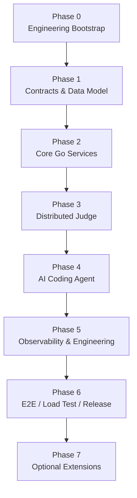
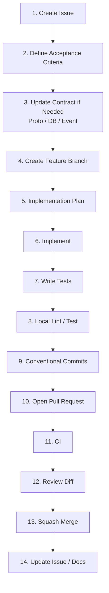

# Distributed Online Judge & AI Coding Agent Platform

## Development Plan

> 本文档定义项目从工程初始化到 `v1.0.0` 的开发路线、阶段目标、交付物、测试要求、Git/PR 流程与完成标准。  
> 项目开发应优先保证 **可运行、可测试、可演示、可追踪、可回滚**，避免为了技术栈数量牺牲工程质量。

---

## 1. Document Information

| Item           | Value                                               |
| -------------- | --------------------------------------------------- |
| Document       | Development Plan                                    |
| Project        | Distributed Online Judge & AI Coding Agent Platform |
| Status         | Draft / Active                                      |
| Version        | v0.1                                                |
| Target Release | v1.0.0                                              |
| Main Backend   | Go + Go-Kratos                                      |
| AI Service     | Python + FastAPI + LangChain + LangGraph            |
| Last Updated   | 2026-08-30                                          |

### 1.1 Related Documents

项目详细设计应拆分维护，不在本文档中重复展开：

```text
docs/
├── requirements.md       # 需求文档：做什么、为什么做、验收场景
├── architecture.md       # 架构文档：服务边界、通信、可靠性、可观测性
├── api.md                # API / Proto / Event Contract
├── database.md           # MySQL / Redis / MinIO 数据设计
└── development-plan.md   # 本文档：如何分阶段完成项目

AGENTS.md                 # Coding Agent 开发约束
README.md                 # 项目入口、运行方式、Demo、文档导航
```

---

# 2. Project Goal

目标是构建一个具备真实工程特征的：

> **Go-Kratos Distributed Online Judge + AI Coding Agent Platform**

核心技术故事：

```text
Go-Kratos 微服务
        +
REST / gRPC / Protobuf
        +
RabbitMQ 可靠异步判题
        +
Transactional Outbox
        +
Go Judge Worker + Sandbox
        +
FastAPI + LangChain/LangGraph Agent
        +
RAG + Tool Calling
        +
OpenTelemetry Observability
```

项目主要用于展示：

- Go 后端工程能力
- 微服务边界设计
- gRPC / Protobuf 契约设计
- RabbitMQ 可靠消息
- 分布式一致性与幂等
- Go 并发与 Judge Worker
- 不可信代码执行隔离
- AI Agent Tool Calling
- RAG 与 Agent Eval
- 自动化测试
- CI/CD 与可观测性
- 规范化 Git / PR / Release 流程

---

# 3. Development Principles

整个项目开发遵循以下原则。

## 3.1 Contract First

先定义服务之间的契约，再实现内部逻辑。

优先确定：

```text
Proto
Database Schema
MQ Event
Redis Key
Object Storage Key
Error Code
Configuration
```

然后再进入业务实现。

---

## 3.2 Small Vertical Iterations

不同时铺开所有服务。

每次优先完成一条可以真正运行的业务链路，例如：

```text
Register
  ↓
Gateway
  ↓
User Service
  ↓
MySQL
```

或者：

```text
Create Submission
  ↓
Submission Service
  ↓
Outbox
  ↓
RabbitMQ
  ↓
Judge Worker
  ↓
Judge Result
```

---

## 3.3 Feature and Test in the Same PR

功能实现和对应测试必须尽量属于同一个 PR。

禁止长期采用：

```text
先写全部功能
    ↓
项目快结束
    ↓
统一补测试
```

---

## 3.4 Data Ownership

每个服务只能直接访问自己拥有的数据。

例如：

```text
user-service       → user domain
problem-service    → problem domain
submission-service → submission domain
contest-service    → contest domain
agent-service      → agent domain
```

跨服务访问通过：

```text
gRPC
RabbitMQ Event
```

完成。

Agent 不允许直接查询 Go 服务数据库。

---

# 4. Overall Roadmap



推荐版本映射：

| Version  | Phase     | Core Deliverable                 |
| -------- | --------- | -------------------------------- |
| `v0.0.1` | Phase 0   | 工程骨架可构建、可测试、基础设施可启动              |
| `v0.1.0` | Phase 1–2 | User / Problem / Submission 核心服务 |
| `v0.2.0` | Phase 3   | 分布式判题链路                          |
| `v0.3.0` | Phase 4   | AI Coding Agent                  |
| `v0.4.0` | Phase 5   | 可观测性与完整 CI                       |
| `v0.5.0` | Phase 6   | E2E、安全强化、压测                      |
| `v1.0.0` | Phase 6   | Portfolio Release                |
| `v1.x`   | Phase 7   | Contest / Qdrant / K8s 等扩展       |

每一个阶段都必须满足：

```text
Build ✅
Test ✅
Run ✅
Demo ✅
Docs ✅
```

---

# 5. Phase 0 — Engineering Bootstrap

## 5.1 Goal

先搭建所有后续开发依赖的工程基础，不实现正式业务功能。

## 5.2 Repository Skeleton

建议初始化：

```text
oj-next/
├── api/
├── services/
│   ├── gateway/
│   ├── user/
│   ├── problem/
│   ├── submission/
│   ├── contest/
│   ├── judge-scheduler/
│   └── judge-worker/
├── agent/
├── pkg/
├── deploy/
├── docs/
├── tests/
├── scripts/
├── .github/
├── Makefile
├── buf.yaml
├── docker-compose.yml
├── AGENTS.md
└── README.md
```

每个 Kratos 服务内部统一：

```text
services/<service>/
├── cmd/
│   └── server/
├── internal/
│   ├── biz/
│   ├── data/
│   ├── service/
│   ├── server/
│   └── conf/
├── configs/
├── Dockerfile
└── Makefile
```

依赖方向：

```text
Transport
   ↓
Service
   ↓
Business
   ↓
Repository Interface
   ↑
Data Implementation
```

---

## 5.3 Base Toolchain

### Go

```text
Go
Go-Kratos
gofmt
go vet
golangci-lint
go test
```

### Python

```text
Python
uv
FastAPI
ruff
pyright or mypy
pytest
```

### Protobuf

```text
protobuf
buf
protoc
Go generated client/server
Python generated client
```

### Infrastructure

Docker Compose 第一版至少包含：

```text
MySQL
Redis
RabbitMQ
MinIO
Consul
```

---

## 5.4 Common Make Commands

根目录逐步统一：

```bash
make init
make generate
make fmt
make lint
make test
make build
make compose-up
make compose-down
```

后续补充：

```bash
make test-unit
make test-integration
make test-e2e
make test-agent
make migrate-up
make migrate-down
```

---

## 5.5 Initial CI

第一版 CI 至少执行：

```text
Proto lint
Go format check
go vet
Go unit test
Go build
Python lint
Python test
```

暂时不需要第一天就加入所有安全扫描。

---

## 5.6 Phase 0 Acceptance Criteria

- [ ] 仓库目录创建完成
- [ ] Go Workspace / Module 正常
- [ ] Python 环境正常
- [ ] Buf / Protobuf 生成正常
- [ ] Docker Compose 可以启动基础设施
- [ ] `make lint` 成功
- [ ] `make test` 成功
- [ ] `make build` 成功
- [ ] GitHub PR CI 正常运行
- [ ] README 提供最小启动说明
- [ ] AGENTS.md 已提交

**Release:** `v0.0.1`

---

# 6. Phase 1 — Contracts and Data Model

## 6.1 Goal

在大规模业务编码前，确定服务通信与数据边界。

重点不是写 Handler，而是回答：

```text
服务拥有什么数据？
服务之间如何通信？
API 的稳定契约是什么？
异步事件格式是什么？
错误如何表达？
```

---

## 6.2 Proto Design

优先设计：

```text
api/
├── common/v1/
├── user/v1/
├── problem/v1/
├── submission/v1/
├── contest/v1/
└── judge/v1/
```

第一版接口：

### User Service

```text
Register
Login
RefreshToken
GetUser
GetCurrentUser
```

### Problem Service

```text
CreateProblem
UpdateProblem
GetProblem
ListProblems
```

### Submission Service

```text
CreateSubmission
GetSubmission
ListSubmissions
```

同时统一定义：

```text
ID type
timestamp
pagination
enum
error code
metadata
request validation
```

---

## 6.3 Database Ownership

逻辑数据库：

```text
oj_user
oj_problem
oj_submission
oj_contest
oj_agent
```

本地开发可以仍然运行一个 MySQL 实例，但必须保持逻辑数据所有权。

必须禁止：

```sql
-- contest-service 直接跨域访问 submission 表
SELECT *
FROM oj_submission.submissions;
```

应该通过：

```text
contest-service
      ↓
gRPC / Event
      ↓
submission-service
```

---

## 6.4 Schema Requirements

每张核心表设计时必须确认：

- Primary Key
- Unique Constraint
- Index
- Status Enum
- `created_at`
- `updated_at`
- Soft Delete 是否必要
- Migration
- 幂等约束
- 数据所有者

---

## 6.5 MQ Event Contract

Judge 尚未实现时，也先确定消息模型。

基础事件：

```text
judge.requested
judge.started
judge.completed
judge.failed

submission.created
submission.judged
```

消息公共字段：

```json
{
  "event_id": "0193...",
  "event_type": "judge.requested",
  "occurred_at": "2026-08-30T10:00:00Z",
  "trace_id": "...",
  "payload": {}
}
```

`judge.requested` 业务字段至少包含：

```json
{
  "submission_id": 10001,
  "problem_id": 1001,
  "language": "cpp"
}
```

---

## 6.6 Phase 1 Acceptance Criteria

- [ ] Core Proto v1 定义完成
- [ ] `buf lint` 通过
- [ ] Go / Python generated code 正常
- [ ] 数据所有权写入 database.md
- [ ] Core Schema v1 完成
- [ ] Migration 方案确认
- [ ] MQ Event v1 完成
- [ ] Redis Key 命名规范确认
- [ ] Error Code 规范确认
- [ ] API / DB 文档同步更新

---

# 7. Phase 2 — Core Go Microservices

## 7.1 Goal

建立第一个真正可用的 Go-Kratos OJ 核心业务版本。

开发顺序：

```text
User
 ↓
Problem
 ↓
Submission
 ↓
Gateway
```

禁止同时把四个服务全部铺开后再收尾。

---

# 7.2 User Service

## Scope

```text
Register
Login
JWT
Refresh Token
Password Hash
RBAC
Current User
Token / Session State
```

## Required Tests

```text
biz unit test
repository integration test
password hash test
JWT test
refresh token test
permission test
duplicate account test
```

## Acceptance

至少跑通：

```text
POST /register
POST /login
GET /users/me
```

---

# 7.3 Problem Service

## Scope

```text
Create Problem
Update Problem
Get Problem
List Problems
Tags
Testcase Metadata
MinIO Testcase Upload
Problem Cache
```

MinIO 保存：

```text
problem-data/
└── problem-1001/
    ├── input/
    └── output/
```

MySQL 只保存对象元数据，例如：

```text
object_key
sha256
size
version
```

## Required Tests

- [ ] Problem CRUD business tests
- [ ] Permission tests
- [ ] Repository integration tests
- [ ] Redis cache hit / invalidation tests
- [ ] MinIO upload tests
- [ ] Testcase metadata validation

---

# 7.4 Submission Service

## Initial Scope

第一版只完成：

```text
Create Submission
Get Submission
List Submissions
Submission State Machine
```

状态建议：

```text
PENDING
QUEUED
JUDGING
ACCEPTED
WRONG_ANSWER
TIME_LIMIT_EXCEEDED
MEMORY_LIMIT_EXCEEDED
RUNTIME_ERROR
COMPILE_ERROR
SYSTEM_ERROR
```

Phase 2 可以暂时接 Fake Judge，以便先打通业务层。

## Required Tests

- [ ] Create submission
- [ ] Ownership / permission
- [ ] State transition
- [ ] Invalid state transition
- [ ] Pagination
- [ ] Repository integration
- [ ] Cache behavior

---

# 7.5 Gateway

Gateway 负责：

```text
External REST
JWT extraction
Rate limiting
Request ID
Trace context
Routing
SSE proxy
Unified error response
```

内部调用：

```text
Gateway
   ↓
gRPC
   ↓
User / Problem / Submission
```

不要在 Gateway 中实现业务逻辑。

---

# 7.6 Phase 2 Acceptance Criteria

完整演示链路：

```text
Register
 ↓
Login
 ↓
List Problems
 ↓
Get Problem
 ↓
Create Submission
 ↓
Get Submission
```

并满足：

- [ ] Go core services 可独立启动
- [ ] Gateway → gRPC 调用正常
- [ ] MySQL migration 正常
- [ ] Redis 正常
- [ ] MinIO 正常
- [ ] Authentication 正常
- [ ] Authorization 正常
- [ ] Unit tests 通过
- [ ] Core integration tests 通过
- [ ] API 文档更新
- [ ] Database 文档更新

**Release:** `v0.1.0`

---

# 8. Phase 3 — Distributed Judge

## 8.1 Goal

构建整个项目最重要的分布式后端链路。

实现顺序固定为：

```text
Transactional Outbox
        ↓
RabbitMQ
        ↓
Judge Scheduler
        ↓
Judge Worker
        ↓
Judge Engine
        ↓
Sandbox
```

不要先从 Sandbox 开始。

---

# 8.2 Transactional Outbox

创建 Submission 时：

```text
BEGIN

INSERT submission

INSERT outbox_event

COMMIT
```

Outbox Relay：

```text
outbox_events
     ↓
Relay
     ↓
RabbitMQ
     ↓
Publisher Confirm
     ↓
mark published
```

重点保证：

```text
MySQL commit 成功
        ⇔
最终 Judge Event 一定可被可靠发布
```

## Required Tests

- [ ] Submission + Outbox 同事务成功
- [ ] Submission 失败时 Outbox 不存在
- [ ] Outbox insert 失败导致事务回滚
- [ ] Relay 成功 publish
- [ ] Publisher Confirm
- [ ] Relay crash 后可恢复
- [ ] 重复 publish 不破坏最终状态

---

# 8.3 RabbitMQ Topology

建议：

```text
Exchange:
oj.events
```

Routing Keys：

```text
judge.requested
judge.started
judge.completed
judge.failed

submission.created
submission.judged
```

Judge Queue：

```text
judge.task.cpp
judge.task.go
judge.task.python
judge.task.java

judge.retry
judge.dlq
```

Consumer 要求：

```text
manual ACK
prefetch
retry
DLQ
idempotent consumer
```

---

# 8.4 Judge Scheduler

职责：

```text
language routing
priority
retry routing
worker queue dispatch
task metadata normalization
```

Scheduler 不执行用户代码。

---

# 8.5 Judge Worker

建议模块：

```text
judge-worker/
├── consumer
├── compiler
├── runner
├── sandbox
├── comparator
├── testcase
└── reporter
```

语言抽象：

```go
type LanguageRunner interface {
    Compile(ctx context.Context, source string) (*Artifact, error)
    Run(ctx context.Context, artifact *Artifact, input []byte) (*Result, error)
}
```

实现：

```text
CppRunner
GoRunner
PythonRunner
JavaRunner
```

---

# 8.6 Judge Engine

执行流程：

```text
Receive Task
    ↓
Load Testcase Metadata
    ↓
Download Testcase
    ↓
Compile
    ↓
Run Cases
    ↓
Compare Output
    ↓
Aggregate Verdict
    ↓
Publish Judge Result
```

可展示的 Go 能力：

```text
goroutine
channel
worker pool
context timeout
errgroup
bounded concurrency
```

---

# 8.7 Sandbox

第一版可以使用 Docker-based Sandbox，但代码设计必须支持替换。

抽象：

```go
type Sandbox interface {
    Execute(ctx context.Context, req RunRequest) (RunResult, error)
}
```

限制至少覆盖：

```text
CPU
Memory
Wall Time
Process Count
File Size
Open Files
Network
Syscalls
Filesystem
User Privilege
```

生产化方向：

```text
Linux Namespace
cgroups v2
seccomp
rlimit
read-only filesystem
network disabled
non-root user
```

可选替换：

```text
nsjail
gVisor
```

---

# 8.8 Judge Result Reliability

Worker 只有在：

```text
Judge finished
      +
Result successfully published
```

之后才 ACK Judge Task。

消费端必须基于：

```text
event_id
submission_id
state/version
```

实现幂等。

---

# 8.9 Phase 3 Required Tests

这一阶段必须重点完成：

1. Submission + Outbox 原子性
2. Outbox Relay 成功发布 RabbitMQ
3. RabbitMQ 未 ACK 时消息重新投递
4. Consumer 重复消息幂等
5. Retry 超限进入 DLQ
6. AC / WA / TLE / MLE / RE / CE
7. Output Comparator table-driven tests
8. Comparator fuzz test
9. Sandbox CPU 限制
10. Sandbox 内存限制
11. Sandbox 进程数限制
12. Sandbox 网络隔离
13. Worker crash recovery
14. Judge Result 重复投递
15. Submit → Judge → Result Integration Test

---

# 8.10 Phase 3 Acceptance Criteria

至少可以完整演示：

```text
POST /submissions
      ↓
Submission Service
      ↓
MySQL + Outbox
      ↓
RabbitMQ
      ↓
Scheduler
      ↓
Worker
      ↓
Sandbox
      ↓
Judge Result
      ↓
Submission Service
      ↓
GET /submissions/{id}
```

满足：

- [ ] Outbox 可恢复
- [ ] Publisher Confirm
- [ ] Manual ACK
- [ ] Prefetch
- [ ] Retry
- [ ] DLQ
- [ ] Idempotent Consumer
- [ ] Judge 多语言抽象
- [ ] Sandbox 基本资源隔离
- [ ] Core Judge Integration Tests 通过

**Release:** `v0.2.0`

---

# 9. Phase 4 — AI Coding Agent

## 9.1 Goal

Agent 必须真正使用 OJ 后端能力，而不是成为独立聊天机器人。

定位：

> **Coding Learning Agent**

技术栈：

```text
FastAPI
LangChain
LangGraph
gRPC
RAG
SSE
pytest
Agent Eval
```

---

# 9.2 Agent Service Structure

建议：

```text
agent/
├── app/
│   ├── api/
│   ├── agents/
│   ├── graphs/
│   ├── tools/
│   ├── rag/
│   ├── clients/
│   ├── models/
│   └── core/
├── evals/
└── tests/
```

---

# 9.3 gRPC Tools

第一批 Tool：

```text
GetProblem
GetSubmission
ListRecentSubmissions
SearchProblems
GetJudgeResult
RetrieveKnowledge
RecommendProblem
```

调用链：

```text
LangChain Tool
     ↓
Python gRPC Client
     ↓
Go-Kratos Service
```

禁止：

```text
Agent
  ↓
直接查 user/problem/submission 数据库
```

---

# 9.4 First Agent Workflow

第一条高价值 Workflow：

```text
User:
为什么 submission 123 WA？

        ↓
Context Resolver
        ↓
GetSubmission(123)
        ↓
GetProblem(...)
        ↓
GetJudgeResult(123)
        ↓
RetrieveKnowledge(...)
        ↓
LLM Analysis
        ↓
Answer
```

然后扩展：

```text
Compile Error Analysis
TLE Analysis
RE Analysis
Progressive Hint
Problem Recommendation
Learning Review
```

---

# 9.5 Permission Boundary

Agent 调用后端时携带：

```text
user identity
role
trace context
service identity
```

真正的授权必须由目标 Go Service 完成。

例如：

```text
Agent calls GetSubmission(123)
          ↓
submission-service checks:
submission.user_id == current_user_id
```

禁止把 Agent 当成高权限数据库代理。

---

# 9.6 RAG

Local Profile：

```text
Chroma
```

Production-like 可替换：

```text
Qdrant
```

资料来源：

```text
algorithm notes
editorials
course notes
platform docs
classic bug cases
```

Pipeline：

```text
Document
  ↓
MinIO
  ↓
Ingestion Worker
  ↓
Loader
  ↓
Splitter
  ↓
Embedding
  ↓
Vector Store
```

建议 metadata：

```text
problem_id
algorithm
difficulty
language
document_type
```

---

# 9.7 SSE

统一事件：

```text
thinking
tool_call
tool_result
token
done
error
```

链路：

```text
Browser
  ↓ SSE
Gateway
  ↓
Agent Service
```

---

# 9.8 Agent Eval

维护：

```text
agent/evals/
├── debug_wa.jsonl
├── debug_tle.jsonl
├── compile_error.jsonl
├── permission.jsonl
└── hint.jsonl
```

优先测试确定性行为：

```text
Tool selection
Tool arguments
Permission
Workflow transition
Structured output
Forbidden access
```

不要使用逐字答案匹配作为主要 Eval。

---

# 9.9 Phase 4 Acceptance Criteria

- [ ] FastAPI Agent 可独立启动
- [ ] Python gRPC Client 正常
- [ ] GetProblem Tool 完成
- [ ] GetSubmission Tool 完成
- [ ] GetJudgeResult Tool 完成
- [ ] RAG Tool 完成
- [ ] WA Diagnosis Workflow 可运行
- [ ] SSE Streaming 正常
- [ ] User A 不能读取 User B Submission
- [ ] Agent Eval 基线建立
- [ ] Agent unit/integration tests 通过

**Release:** `v0.3.0`

---

# 10. Phase 5 — Observability and Engineering Hardening

## 10.1 Goal

把系统从：

> 能运行

提升为：

> 出问题以后可以定位原因。

从 Phase 1 开始就应该保留：

```text
trace_id
structured logging
OpenTelemetry middleware
trace context
```

本阶段完成完整基础设施。

---

# 10.2 Observability Stack

```text
OpenTelemetry
      │
      ├── Metrics → Prometheus → Grafana
      │
      └── Trace   → Jaeger / Tempo
```

重点追踪：

```text
Gateway
 ↓
Submission Service
 ↓
RabbitMQ
 ↓
Scheduler
 ↓
Judge Worker
```

RabbitMQ Message Header 传递：

```text
traceparent
```

---

# 10.3 Core Metrics

建议至少建立：

### API

```text
request count
error rate
latency
P95
P99
```

### RabbitMQ

```text
publish rate
consume rate
queue depth
retry count
DLQ count
unacked messages
```

### Judge

```text
judge throughput
compile latency
execution latency
verdict distribution
worker busy rate
worker failure rate
```

### Storage

```text
DB latency
DB error rate
Redis hit ratio
MinIO latency
```

### Agent

```text
request latency
tool call count
tool failure count
RAG latency
workflow error rate
token usage
```

---

# 10.4 Final PR CI Pipeline

```text
Pull Request
     │
     ├── Proto lint
     ├── buf breaking
     │
     ├── gofmt check
     ├── go vet
     ├── golangci-lint
     ├── go test
     │
     ├── ruff
     ├── type check
     ├── pytest
     │
     ├── integration test
     │
     ├── docker build
     │
     └── security scan
            ↓
        Required Checks
            ↓
           Merge
```

可逐步加入：

```text
Dependency Review
CodeQL
Container Scan
SBOM
```

---

# 10.5 Phase 5 Acceptance Criteria

- [ ] Structured Log 全服务统一
- [ ] Trace ID 跨 HTTP/gRPC/MQ 传递
- [ ] Prometheus 可抓取 Metrics
- [ ] Grafana 基础 Dashboard
- [ ] Jaeger/Tempo 可看到完整提交 Trace
- [ ] CI 完整运行
- [ ] Required Status Checks 配置
- [ ] Docker Image Build 正常
- [ ] Security Scan 基础能力完成

**Release:** `v0.4.0`

---

# 11. Phase 6 — E2E, Load Testing and Release

## 11.1 Goal

停止大规模增加功能，集中完成：

```text
system validation
bug fixing
security hardening
performance testing
documentation
demo
release
```

---

# 11.2 E2E Scenarios

至少实现：

### User

```text
Register
  ↓
Login
  ↓
Get Current User
```

### Problem

```text
Create Problem
  ↓
Upload Testcase
  ↓
Get Problem
```

### Judge

```text
Submit
  ↓
Queue
  ↓
Judge
  ↓
Result
```

### Agent

```text
Ask Question
  ↓
Agent Tool
  ↓
Submission / Problem Context
  ↓
Answer
```

---

# 11.3 Load Testing

使用 k6 测：

```text
Login
Problem List
Problem Detail
Create Submission
Submission Query
```

Judge 单独做吞吐测试：

```text
Large Submission Burst
        ↓
RabbitMQ Backlog
        ↓
Increase Worker Count
        ↓
Observe Throughput
```

收集：

```text
QPS
P50
P95
P99
Error Rate
MQ Backlog
Judge Throughput
DB Latency
Cache Hit Ratio
CPU
Memory
```

---

# 11.4 Security Validation

至少验证：

- [ ] JWT 失效处理
- [ ] RBAC
- [ ] User Data Isolation
- [ ] Agent Tool Permission
- [ ] SQL Injection 基础防护
- [ ] Request Validation
- [ ] Rate Limiting
- [ ] Secret 不进入 Git
- [ ] Sandbox Network Isolation
- [ ] Sandbox CPU / Memory Limits
- [ ] Untrusted Code 不以 Root 运行
- [ ] Image / Dependency 基础扫描

---

# 11.5 Release Preparation

`v1.0.0` 前完成：

```text
README
Requirements
Architecture
API
Database
Development Plan
AGENTS.md
Demo Script
Architecture Diagram
Deployment Guide
Test Report
Load Test Result
Known Issues
Release Notes
```

建议录制完整 Demo：

```text
Login
 ↓
Problem
 ↓
Submit
 ↓
Judge State Streaming
 ↓
Accepted / Wrong Answer
 ↓
AI Diagnosis
 ↓
Trace / Grafana
```

---

# 11.6 Phase 6 Acceptance Criteria

- [ ] Core E2E 全部通过
- [ ] Core Integration Test 稳定
- [ ] Security Checklist 完成
- [ ] k6 Load Test 完成
- [ ] 关键性能数据记录
- [ ] README 完整
- [ ] 架构文档完整
- [ ] Demo 可重复运行
- [ ] Known Issues 明确
- [ ] Release Notes 完成

**Release:** `v0.5.0`

最终整理、修复和文档完成后：

**Release:** `v1.0.0`

---

# 12. Phase 7 — Optional Extensions

只有 `v1.0.0` 主链路完成后再考虑。

可选：

```text
Contest Service
Redis ZSET Realtime Leaderboard
Qdrant
Adaptive Recommendation
Admin Agent
Human-in-the-loop
Kubernetes
Horizontal Scaling
Quorum Queue
More Languages
```

这些属于加分项，不是 `v1.0.0` 阻塞项。

特别是以下内容不要过早引入：

```text
Kafka
Istio
Nacos
MongoDB
ClickHouse
Elasticsearch
Multi-Agent Swarm
```

除非已有明确业务需求。

---

# 13. Daily Feature Development Workflow

所有功能默认遵循：



---

# 14. Issue Rules

一个功能在开发前尽量先创建 Issue。

示例：

```markdown
# Implement transactional outbox

## Goal

Guarantee reliable publication of judge requests after submission creation.

## Requirements

- Create outbox_events table
- Persist submission and outbox event in one transaction
- Implement relay worker
- Support publisher confirms
- Handle retry
- Add integration tests

## Acceptance Criteria

- DB transaction is atomic
- Published messages are eventually delivered
- Relay restart does not lose events
- Duplicate delivery does not corrupt submission state
```

---

# 15. Branch Rules

推荐 GitHub Flow。

```text
main
 │
 ├── feat/*
 ├── fix/*
 ├── refactor/*
 ├── test/*
 ├── docs/*
 ├── chore/*
 ├── ci/*
 └── perf/*
```

示例：

```text
feat/23-transactional-outbox
feat/agent-wa-diagnosis
fix/judge-timeout
refactor/problem-repository
test/submission-idempotency
docs/development-plan
ci/integration-tests
```

要求：

- `main` 禁止直接 push
- Feature Branch 尽量短生命周期
- 一个 Branch 对应一个明确 Issue / Feature
- 禁止 `dev1`、`new2`、`final-final` 等无语义名称

---

# 16. Commit Rules

采用 Conventional Commits：

```text
<type>(<scope>): <description>
```

常用 Type：

```text
feat
fix
refactor
test
docs
chore
ci
perf
build
```

示例：

```text
feat(submission): add outbox event model

feat(submission): persist outbox event transactionally

feat(submission): implement outbox relay

test(submission): add outbox integration tests

fix(judge): prevent duplicate result update

docs(architecture): document judge workflow
```

原则：

> 一个 commit 表达一个逻辑变更。

---

# 17. Pull Request Rules

推荐 PR 模板包含：

```markdown
## What

本 PR 做了什么？

## Why

为什么需要这个修改？

## Changes

- ...
- ...

## Testing

- [ ] Unit Test
- [ ] Integration Test
- [ ] Manual Verification

## Architecture Impact

- [ ] Proto
- [ ] Database Schema
- [ ] MQ Event
- [ ] Redis Key
- [ ] MinIO Object
- [ ] Configuration
- [ ] Security Boundary
- [ ] Observability

## Checklist

- [ ] Lint passed
- [ ] Tests passed
- [ ] Docs updated
- [ ] No secret committed
```

默认使用：

```text
Squash Merge
```

保持 `main` 历史清晰。

---

# 18. Testing Strategy

测试层级：

```text
                  E2E
                 /   \
          Integration
           /         \
      Contract      Agent Eval
           \         /
              Unit
```

---

## 18.1 Unit Test

重点：

```text
business logic
state machine
permission
verdict aggregation
output comparator
rate limiting logic
score calculation
message codec
```

Go 优先 table-driven tests。

---

## 18.2 Fuzz Test

OJ 非常适合 fuzz：

```text
output comparator
testcase parser
message decoder
source metadata parser
```

基本要求：

> 无论输入多异常，都不应该无控制 panic。

---

## 18.3 Integration Test

真实启动：

```text
MySQL
Redis
RabbitMQ
MinIO
```

重点验证：

```text
SQL constraint
Redis TTL
RabbitMQ ACK
Outbox atomicity
Publisher Confirm
Retry / DLQ
MinIO object behavior
```

---

## 18.4 Contract Test

至少执行：

```text
buf lint
buf breaking
generated code check
Go server compatibility
Python client compatibility
```

---

## 18.5 Agent Eval

重点测试：

```text
tool selection
tool arguments
permission
workflow state
structured output
forbidden data access
```

---

## 18.6 E2E

核心场景：

```text
Register → Login

Create Problem → Upload Testcase

Submit → Judge → Result

Agent → Tool → Submission → Answer
```

---

# 19. CI Quality Gates

PR 合并前最低要求：

```text
Proto Check ✅
Go Lint ✅
Go Test ✅
Python Lint ✅
Python Test ✅
Build ✅
```

进入核心开发后增加：

```text
Integration Test ✅
buf breaking ✅
Docker Build ✅
Security Scan ✅
```

核心 CI 失败时：

```text
禁止 Merge
```

---

# 20. Definition of Done

任何 Feature 完成前必须确认：

## Code

- [ ] 功能满足 Acceptance Criteria
- [ ] 代码符合当前服务边界
- [ ] 没有跨服务直接访问数据库
- [ ] 没有明显重复实现
- [ ] 错误处理完整
- [ ] Context / Timeout 正确
- [ ] 日志不泄漏敏感信息

## Contract

- [ ] Proto 已更新（如适用）
- [ ] Database Migration 已更新（如适用）
- [ ] MQ Event 已更新（如适用）
- [ ] Redis Key 文档已更新（如适用）

## Test

- [ ] Unit Test
- [ ] Integration Test（如涉及外部依赖）
- [ ] Permission Test（如涉及用户数据）
- [ ] Contract Test（如修改 Proto）
- [ ] Agent Eval（如修改 Agent）
- [ ] Bug Fix 有 Regression Test

## Engineering

- [ ] `make lint` 通过
- [ ] `make test` 通过
- [ ] `make build` 通过
- [ ] CI 通过
- [ ] 无 Secret
- [ ] Docs 更新
- [ ] PR Diff 已 Review

---

# 21. Agent-Assisted Development Rules

Coding Agent 可以用于：

```text
implementation plan
boilerplate
unit tests
integration tests
refactor suggestions
code review
documentation
migration draft
proto draft
debugging
```

但 Agent 不负责最终架构决策。

推荐流程：

```text
Issue
 ↓
Acceptance Criteria
 ↓
Agent reads relevant docs
 ↓
Agent proposes plan
 ↓
Small implementation
 ↓
Tests
 ↓
Human reviews diff
 ↓
CI
 ↓
Merge
```

任何 Agent 生成的代码都必须通过正常工程门禁。

---

# 22. Architecture Questions Before Merge

涉及架构的改动，在合并前应该能回答：

1. Why does this change belong to this service?
2. What happens when it fails?
3. How is consistency preserved?
4. How can tests prove it works?
5. How can logs, metrics or traces show its behavior?

Agent 相关功能还必须回答：

6. What data can this tool access?
7. Who performs the final authorization?
8. Can untrusted prompt or retrieved content bypass that boundary?

---

# 23. Documentation Update Matrix

| Change                        | Required Docs                  |
| ----------------------------- | ------------------------------ |
| New user-facing feature       | `requirements.md`, `api.md`    |
| Service boundary change       | `architecture.md`              |
| New Proto/RPC                 | `api.md`                       |
| HTTP/SSE change               | `api.md`                       |
| MQ Event change               | `api.md`, `architecture.md`    |
| Database Schema change        | `database.md`                  |
| Redis Key change              | `database.md`                  |
| MinIO Object structure change | `database.md`                  |
| New infrastructure            | `architecture.md`, `README.md` |
| New development rule          | `AGENTS.md`                    |
| Phase / milestone change      | `development-plan.md`          |

---

# 24. Release Strategy

采用 Semantic Versioning：

```text
MAJOR.MINOR.PATCH
```

项目初期：

```text
0.x.y
```

表示仍处于快速开发阶段。

建议：

```text
v0.0.1  Engineering Bootstrap
v0.1.0  Core Services
v0.2.0  Distributed Judge
v0.3.0  AI Agent
v0.4.0  Observability / Engineering
v0.5.0  Hardening
v1.0.0  Portfolio Release
```

每一个 Release 至少包含：

```text
Features
Fixes
Architecture Changes
Migration Notes
Known Issues
Upgrade Notes
```

---

# 25. Explicit Non-Goals Before v1.0.0

以下内容默认不作为 `v1.0.0` 必需项：

- Kubernetes Production Cluster
- Service Mesh
- Multi-region Deployment
- Kafka
- Elasticsearch
- ClickHouse
- MongoDB
- Multi-Agent Architecture
- Fully Automated AI Problem Generation
- Large-scale Recommendation System

原则：

> **先把核心链路做深，再增加技术广度。**

---

# 26. Recommended Execution Order

整个计划最终压缩为：

```text
Engineering Rules
      ↓
Proto / DB / Event Contract
      ↓
Go Core Services
      ↓
RabbitMQ + Transactional Outbox
      ↓
Judge Worker + Sandbox
      ↓
AI Coding Agent
      ↓
Observability
      ↓
E2E + Load Test
      ↓
v1.0.0
```

最重要的技术证明顺序是：

```text
Go 微服务可以正确协作
        ↓
分布式判题可以可靠运行
        ↓
不可信代码可以被受控执行
        ↓
Agent 可以通过受控 Tool Calling 使用后端能力
        ↓
系统可以被测试、追踪、压测和发布
```

---

# 27. Final v1.0.0 Checklist

## Product

- [ ] User
- [ ] Problem
- [ ] Submission
- [ ] Judge
- [ ] AI Diagnosis

## Backend

- [ ] Go-Kratos
- [ ] REST
- [ ] gRPC
- [ ] Protobuf
- [ ] MySQL
- [ ] Redis
- [ ] RabbitMQ
- [ ] MinIO
- [ ] Consul

## Reliability

- [ ] Transactional Outbox
- [ ] Publisher Confirm
- [ ] Manual ACK
- [ ] Retry
- [ ] DLQ
- [ ] Idempotent Consumer

## Judge

- [ ] Multiple Languages
- [ ] Worker Pool
- [ ] Timeout
- [ ] Sandbox
- [ ] AC / WA / TLE / MLE / RE / CE

## Agent

- [ ] FastAPI
- [ ] LangChain
- [ ] LangGraph
- [ ] gRPC Tools
- [ ] RAG
- [ ] Permission Boundary
- [ ] SSE
- [ ] Agent Eval

## Engineering

- [ ] Unit Test
- [ ] Fuzz Test
- [ ] Integration Test
- [ ] Contract Test
- [ ] E2E
- [ ] CI
- [ ] OpenTelemetry
- [ ] Prometheus
- [ ] Grafana
- [ ] Jaeger / Tempo
- [ ] k6

## Documentation

- [ ] README
- [ ] Requirements
- [ ] Architecture
- [ ] API
- [ ] Database
- [ ] Development Plan
- [ ] AGENTS.md
- [ ] Release Notes

---

# 28. Conclusion

本项目的开发重点不是尽快堆出所有功能，而是形成一条完整、可信的工程链路：

> **Contract First → Go Microservices → Reliable Distributed Judge → Secure Sandbox → AI Tool Calling → Automated Testing → Observability → Release**

任何新技术或新功能在加入前，都应该回答两个问题：

1. 它是否直接改善当前项目的可靠性、可维护性、性能、安全或用户价值？
2. 它是否值得为 `v1.0.0` 增加额外复杂度？

如果答案不明确，则优先完成当前阶段，而不是扩张范围。
